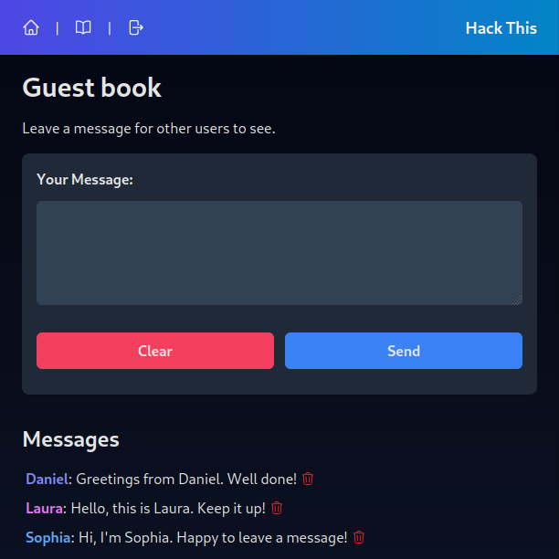

<div align="center">
  
</div>

<h1 align="center">
  Hack This
</h1>

<div align="center">

  A lesson on web application security

</div>

<div align="center">


</div>

## About

**Hack This** is a simple fullstack web application that contains several security vulnerabilities. The application can be used to demonstrate how mistakes by the developers can lead to compromised security.

> **Warning**  
> Do not use the code found in this repository in production. Also, do not use it to do anything illegal or exploit systems that you do not own or have a permission to enter. **For educational purposes only**.

> **Info**  
> For a fixed (secure) version of the application, see the [fixed](https://github.com/rikurauhala/hack-this/tree/fixed) branch.

<details>
  <summary>
    Screenshot
  </summary>
  <p>
    
  </p>
  <p>
    <i>
      The guest book page of the application, viewed as an admin
    </i>
  </p>
</details>

## How to install

Follow the instructions to set up the project.

### Prerequisites

- `node` version 18.7.0 or higher
- `npm` version 9.8.0 or higher
- `sqlite3` should be installed
- `git` should be installed
- `linux` is recommended

### Installation script

An [installation script](scripts/install.sh) has been written to automate the installation process. Install the application by running the script or follow the instructions below for a manual installation.

```bash
# Move to a directory where you wish to install the application
$ cd Downloads

# Get the script
$ wget https://raw.githubusercontent.com/rikurauhala/hack-this/main/scripts/install.sh

# Make it executable
$ chmod +x install.sh

# Run the script
$ ./install.sh
```

### Manual installation

#### Source code

To install the application, start by downloading the source code from the [project repository](https://github.com/rikurauhala/hack-this). You may use your [preferred method](https://docs.github.com/en/repositories/creating-and-managing-repositories/cloning-a-repository) but for this example I am using the `git clone` command using ssh.

Change directory to the newly created folder containing the source code.

```bash
# Move into an appropriate directory where you want to store the source code
$ cd Downloads

# Get the source code
$ git clone git@github.com:rikurauhala/hack-this.git

# Move into the project directory
$ cd ./hack-this
```

#### Backend

The repository contains the source code of both the frontend and the backend. Let's set up the backend first.

See below for a list of commands to run. Fill in the environment variables `DATABASE_URL` and `SECRET` with your own values.

```bash
# Change directory into the backend folder
$ cd ./server

# Install dependencies
$ npm install

# Create and initialize the database
$ cd ./data
$ touch database.db
$ sqlite3 database.db < init.sql

# Create the .env file
$ cd ..
$ touch .env
$ echo DATABASE_URL="path to your database file (data/database.db)" >> .env
$ echo LOG_FILE_PATH="path to your log file (data/log.txt)" >> .env
$ echo SECRET="a random string" >> .env
```

#### Frontend

Now let's install the frontend.

```bash
# Change directory into the frontend folder
$ cd ../web

# Install dependencies
$ npm install
```

## How to run

Use the following commands to run the backend and frontend separately. Make sure you are in the correct directories for each command.

```bash
# Run the backend
$ npm run dev

# Run the frontend
$ npm start
```
