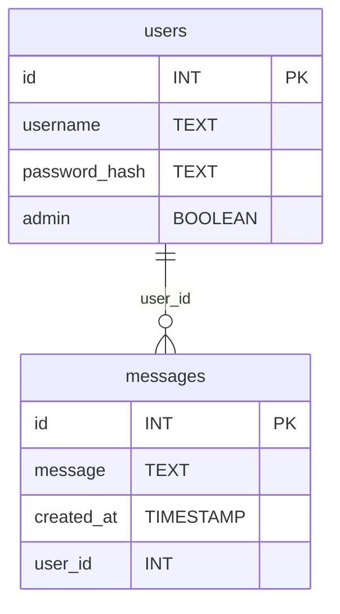

# Database

The application uses an SQLite3 database.

## SQL

```sql
CREATE TABLE users (
  id INTEGER PRIMARY KEY,
  username TEXT NOT NULL UNIQUE,
  password_hash TEXT NOT NULL,
  admin BOOLEAN DEFAULT 0
);

CREATE TABLE messages (
  id INTEGER PRIMARY KEY,
  message TEXT NOT NULL,
  created_at TIMESTAMP DEFAULT CURRENT_TIMESTAMP,
  user_id INTEGER,
  FOREIGN KEY (user_id) REFERENCES users(id)
);
```

## Diagram


